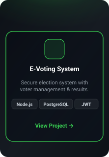
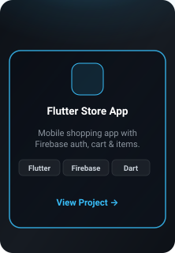
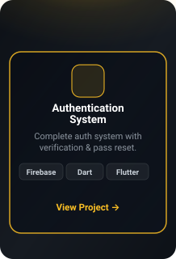

<!-- ==================================================================
  NATNAEL ZERIHUN - GITHUB PROFILE README
  The four cards below are custom SVGs refreshed daily with real data
  by a GitHub Action (see .github/workflows/update-profile-data.yml).
================================================================== -->

<!-- HERO SECTION -->

  

 

<!-- TECH STACK + TOP LANGUAGES -->

  

 

<!-- FEATURED PROJECTS -->
<!-- Each card below is its OWN image wrapped in a real markdown link, so
     clicking it opens the actual repo instead of the raw SVG asset. -->

  
  
  
  

 

<!-- GITHUB STATS, STREAK & QUOTE -->
<!-- This card only has ONE link target (your GitHub profile), so wrapping
     the whole image in one <a> works and matches the "View GitHub Profile" button. -->

  

 

<!-- FOOTER -->

  Thanks for visiting! ⭐ If you like my work, consider giving a <b>star</b> to my repositories!

