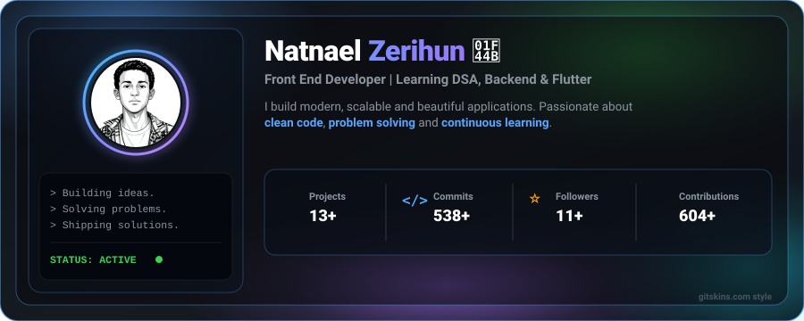
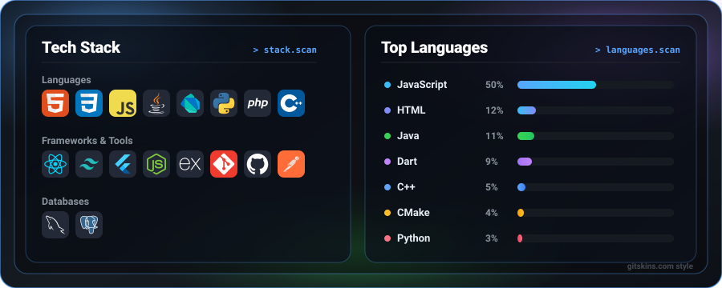
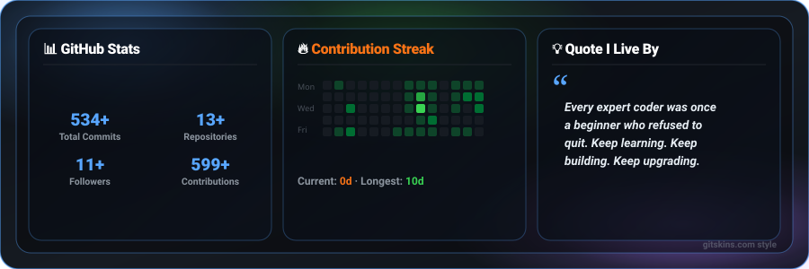

<!-- ==================================================================
  NATNAEL ZERIHUN - GITHUB PROFILE README
  The cards below are custom SVGs refreshed daily with real data
  by a GitHub Action (see .github/workflows/update-profile-data.yml).
================================================================== -->

<!-- HERO SECTION -->
<!-- Wrapped in <picture> so GitHub doesn't auto-link the image to its own raw file. -->

  <picture></picture>

<!-- HERO ACTION BUTTONS — each is its own tiny SVG wrapped in its own <a>,
     so every button opens its own destination instead of the whole card
     linking to one place. -->

  
  
  
  

 

<!-- TECH STACK + TOP LANGUAGES -->

  <picture></picture>

 

<!-- GITHUB STATS, STREAK & QUOTE -->

  <picture></picture>

<!-- STATS DASHBOARD BUTTON -->

  

 

<!-- FOOTER -->

  Thanks for visiting! ⭐ If you like my work, consider giving a <b>star</b> to my repositories!

