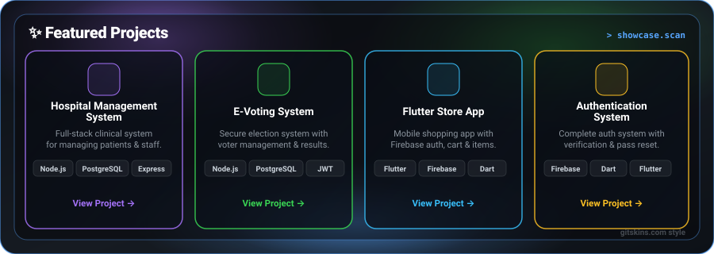

<!-- ==================================================================
  NATNAEL ZERIHUN - GITHUB PROFILE README
================================================================== -->

<!-- HERO SECTION (ROW 1) -->

  

 

<!-- TECH STACK & CURRENTLY LEARNING (ROW 2) -->

  

 

<!-- FEATURED PROJECTS (ROW 3) -->

  

 

<!-- GITHUB STATS, STREAK & QUOTE (ROW 4) -->

  

 

<!-- FOOTER -->

  Thanks for visiting! ⭐ If you like my work, consider giving a <b>star</b> to my repositories!

